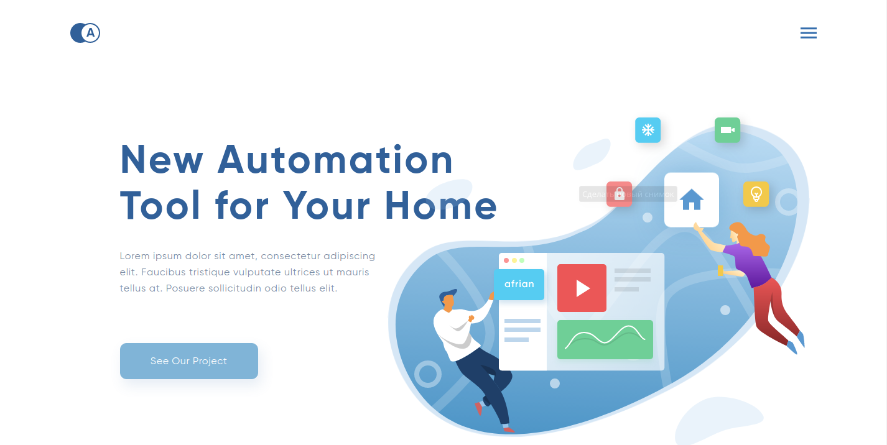

![GitHub repo size][repo-size-shield]
![GitHub commit activity][repo-activity]

  <h3 align="center">Afrianska</h3>

  

    <a href="https://tripplicate.github.io/Afrianska/">See work</a>
    ·
    <a href="https://bit.ly/3cNCxg0">Figma Project</a>
  

<!-- TABLE OF CONTENTS -->

  
Content

   
  <ol>
    <li>
      <a href="#desciption">Description</a>
    </li>
    <li>
      <a href="#technologies">Technologies</a>
    </li>
    <li><a href="#author">Author</a></li>
  </ol>

## Description

Educational project for the practice of layout

## Technologies

- [Pug](https://pugjs.org/api/getting-started.html)
- [SASS](https://sass-lang.com/)

## Author

Danil Sergeev - [telegram](https://t.me/tripplicate) - @tripplicate

<!-- MARKDOWN LINKS & IMAGES -->

[repo-size-shield]: https://img.shields.io/github/repo-size/tripplicate/Afrianska?color=%2363b6d9&style=for-the-badge
[repo-activity]: https://img.shields.io/github/commit-activity/y/tripplicate/Afrianska?color=%2363b6d9&style=for-the-badge
